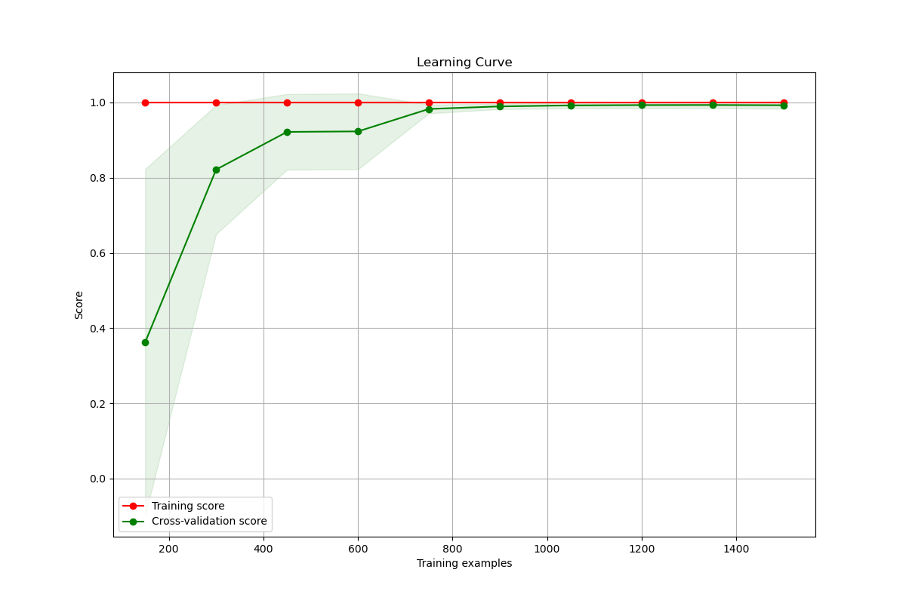

# Predicting UK House Prices Using Machine Learning

## Overview 

This project contains several Jupyter notebooks focused on analyzing factors affecting house prices in the UK, selecting relevant features, and evaluating different models. The analysis is divided into three main notebooks, each covering specific aspects of the overall project.

## Team Members 
    - Najma Ali
    - Sheyma Mukhtar
    - Vittorio Regalbuto

## Introduction 

House prices in the UK are influenced by various factors, including property type, location, and market conditions. Accurate prediction of house prices is valuable for buyers, sellers, investors, and policymakers. This project leverages machine learning techniques to analyze these factors and predict house prices.

## Data

The data used in this project is sourced from the UK House Price Index. It includes information on average prices, sales volumes, and other relevant metrics for different types of properties across various regions in the UK.

### Languages and Tools

#### Programming Languages:
- **Python**: Used for data analysis, visualization, and machine learning model implementation.

#### Libraries and Tools:
- **Pandas**: For data manipulation and analysis.
- **NumPy**: For numerical computations.
- **Matplotlib**: For creating static, interactive, and animated visualizations in Python.
- **Seaborn**: For making statistical graphics in Python.
- **Scikit-learn**: For machine learning model building, evaluation, and hyperparameter tuning.
- **Spark**:For distributed data processing.
- **XGBRegressor**:For gradient boosting regression.
- **SparkSession**:For initializing and managing Spark applications.
- **os**: For interacting with the operating system.

#### Platforms:

- **Microsoft SQL Server**: For data storage and retrieval if using SQL queries for data manipulation.
- **Power BI**: For advanced data visualization and business intelligence (if used for further analysis).

## Clean and prepare data

 - Loading Data: The dataset is loaded from a CSV file.
 - Data Cleaning: Handling missing values, converting data types, and normalizing/standardizing numerical features.
 - Feature Engineering: Creating new features, encoding categorical variables, and selecting relevant features for the model.

## Model Training and Evaluation

 - Data Splitting: Split the data into training and testing sets.
 - Model Selection: Choose appropriate machine learning models (e.g., Random Forest, Linear Regression).
 - Hyperparameter Tuning: Use GridSearchCV for hyperparameter tuning.
 - Model Evaluation: Evaluate the models using R-squared score and other relevant metrics.

## Conclusion

The machine learning models were able to predict house prices with high accuracy. The primary factors affecting house prices were identified as the type of property, regional differences, and historical trends. The models demonstrated robust predictive power, which can be valuable for various stakeholders in the housing market.

## Ethical consideration

When building predictive models, it is important to consider ethical implications such as data privacy, bias in data, and the impact of predictions on different communities. Measures were taken to ensure the data was anonymized and to mitigate potential biases in the analysis.

## References

    1. UK House Price Index - https://www.gov.uk/government/statistical-data-sets/uk-house-price-index-data-downloads-april-2024

    2. matplotlib - https://matplotlib.org

    3. sklearn - https://scikit-learn.sourceforge.net/stable/

    4. power Bi - https://www.microsoft.com/en-us/power-platform/products/power-bi/downloads 

## Packages Required

To run the code and reproduce the results, you will need the following Python packages:

pip install pandas numpy matplotlib seaborn scikit-learn xgboost pyspark

